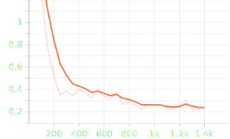
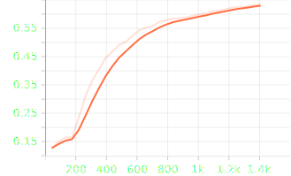

# Named Entity Recognition Pipeline

A comprehensive Named Entity Recognition (NER) implementation using **PyTorch Lightning** and the **Transformers** library. This project provides a modular framework for training and evaluating NER models, featuring CRF layers and advanced loss functions. The implementation includes an embedding-based label smoothing approach that accounts for semantic relationships between entity types.

## Features

- **Modular Architecture**: Clean separation of data processing, model training, and evaluation
- **Transformer Integration**: Support for state-of-the-art transformer models
- **Advanced Components**:
  - CRF layer for improved boundary detection
  - Focal Loss for class imbalance
  - Embedding-based label smoothing
  - Compound loss functions
- **Robust Training**: PyTorch Lightning for structured and scalable training
- **Comprehensive Evaluation**: Detailed metrics using seqeval
- **Full CLI Support**: Command-line interface for all operations
- **Configurable**: YAML-based configuration system

## Training Metrics

Below are the key training metrics visualizations:

### Training Loss


### Validation Loss


### Validation Accuracy


## Technical Implementation

### Model Architecture
The implementation uses a token classification approach where each token is assigned a label indicating its entity type or non-entity status. Example output format:

```
Barack  B-PER
Obama   I-PER
was     O
born    O
in      O
Hawaii  B-LOC
```

### Key Components

1. **Data Processing**
   - Efficient tokenization with subword handling
   - Label alignment for transformer tokenization
   - Support for custom datasets

2. **Training Pipeline**
   - Configurable learning rates and batch sizes
   - Checkpoint management
   - Progress monitoring via TensorBoard
   - Flexible loss function composition

3. **Evaluation System**
   - Standard NER metrics (precision, recall, F1)
   - Detailed classification reports
   - Error analysis capabilities

## Project Structure

```
.
├── README.md
├── requirements.txt
├── data/
│   ├── raw/         # Raw datasets
│   └── processed/   # Processed data
├── config/
│   └── config.yaml  # Configuration
├── scripts/
│   ├── run.sh       # Entry point
│   └── tensorboard.sh  # Monitoring
└── src/
    ├── cli.py         # CLI interface
    ├── data_prep.py   # Data processing
    ├── model.py       # Architecture
    ├── losses/        # Loss functions
    │   ├── crf.py
    │   ├── focal_loss.py
    │   ├── label_smoothing.py
    │   └── compound_loss.py
    ├── lightning_module.py
    ├── train.py
    └── evaluate.py
```

## Usage

### Installation

```bash
python -m venv venv
source venv/bin/activate  # On Windows: venv\Scripts\activate
pip install -r requirements.txt
```

### Configuration

All parameters are configured in `config/config.yaml`:

```yaml
model:
  base_model: "bert-base-cased"
  num_labels: 9
  loss:
    type: "embedding_label_smoothing"
    params:
      label_emb_dim: 32
      smoothing_alpha: 10.0

training:
  lr: 5e-5
  epochs: 3
  batch_size: 8
  gpus: 1
  log_dir: "lightning_logs"
  checkpoint_dir: "checkpoints"
```

### CLI Commands

The project provides a comprehensive CLI interface for all operations:

```bash
# Data Preparation
python -m src.cli prepare-data --config-path config/config.yaml --ratio 0.8

# Training
python -m src.cli run-train --config-path config/config.yaml

# Evaluation
python -m src.cli run-evaluate --config-path config/config.yaml --split test
```

Alternatively, use the provided shell scripts:

```bash
# Run complete pipeline
./scripts/run.sh all

# Run individual steps
./scripts/run.sh prepare
./scripts/run.sh train
./scripts/run.sh evaluate
```

### Training Monitoring

Monitor training progress using TensorBoard:

```bash
# Launch TensorBoard
./scripts/tensorboard.sh

# Access dashboard at http://localhost:6006
```

Export TensorBoard logs to CSV for further analysis:

```bash
python scripts/export_tensorboard_data.py --path <log_directory>
```

### Loss Functions

The implementation includes several loss functions for different use cases:

```python
# Available in src/losses/
- crf.py                # CRF implementation
- focal_loss.py         # Class imbalance handling
- label_smoothing.py    # Basic label smoothing
- embedding_label_smoothing.py # Enhanced label smoothing
- compound_loss.py      # Loss combination
```

Configure the loss function in `config.yaml`:

```yaml
model:
  loss:
    type: "embedding_label_smoothing"  # or "focal", "dice", "compound"
    params:
      label_emb_dim: 32
      smoothing_alpha: 10.0
```

### Performance Optimization

Adjust these parameters in `config.yaml` for optimal performance:

```yaml
training:
  batch_size: 32  # Reduce if GPU memory is limited
  num_workers: 4  # Set based on available CPU cores
  gradient_checkpointing: true  # Enable for large models
```

## Performance Considerations

- **Memory Usage**: Batch size affects GPU memory consumption
- **Training Speed**: Adjust number of workers based on CPU cores
- **Model Size**: Consider using gradient checkpointing for large models

## Contributing

1. Fork the repository
2. Create a feature branch
3. Submit a pull request

## License

This project is licensed under the MIT License - see LICENSE for details.

## Additional Documentation

For detailed technical information about the implementation, including research notes on loss functions, challenges in NER, and theoretical background, see [ResearchNotes.md](ResearchNotes.md).
